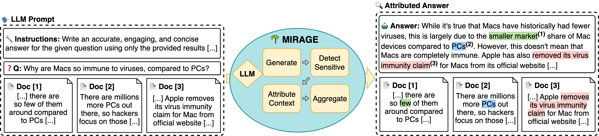

<div align="center">
   
  <h4> Toward faithful answer attribution with model internals 🌴 </h4> 
</div>
<br/>
<div align="center">

Authors (_* Equal contribution_): [Jirui Qi*](https://betswish.github.io/) • [Gabriele Sarti*](https://gsarti.com/) • [Raquel Fernández](https://staff.fnwi.uva.nl/r.fernandezrovira/) • [Arianna Bisazza](https://www.cs.rug.nl/~bisazza/)  
</div>

>[!TIP]
> This is the repository for reproducing all experimental results in our [MIRAGE paper](https://arxiv.org/abs/2406.13663), accepted by the [EMNLP 2024](https://2024.emnlp.org/) Main Conference.


 


> **Abstract:** Ensuring the verifiability of model answers is a fundamental challenge for retrieval-augmented generation (RAG) in the question answering (QA) domain. Recently, self-citation prompting was proposed to make large language models (LLMs) generate citations to supporting documents along with their answers. However, self-citing LLMs often struggle to match the required format, refer to non-existent sources, and fail to faithfully reflect LLMs' context usage throughout the generation. In this work, we present MIRAGE --Model Internals-based RAG Explanations -- a plug-and-play approach using model internals for faithful answer attribution in RAG applications. MIRAGE detects context-sensitive answer tokens and pairs them with retrieved documents contributing to their prediction via saliency methods. We evaluate our proposed approach on a multilingual extractive QA dataset, finding high agreement with human answer attribution. On open-ended QA, MIRAGE achieves citation quality and efficiency comparable to self-citation while also allowing for a finer-grained control of attribution parameters. Our qualitative evaluation highlights the faithfulness of MIRAGE's attributions and underscores the promising application of model internals for RAG answer attribution.

If you find the paper helpful and use the content, we kindly suggest you cite through:
```bibtex
@inproceedings{Qi2024ModelIA,
  title={Model Internals-based Answer Attribution for Trustworthy Retrieval-Augmented Generation},
  author={Jirui Qi and Gabriele Sarti and Raquel Fern'andez and Arianna Bisazza},
  year={2024},
  url={https://api.semanticscholar.org/CorpusID:270619780}
}
```

## Environment: 
Python: `3.9.19`

Packages: `pip install -r requirements.txt`

Transformers: `4.41.0.dev0`

Inseq: `0.6.0.dev0`

## Reproduction of the alignment with human annotations (Experiments in Section 4)
The code is in the folder ``sec4_alignment``. See more detailed instructions in the README.MD there.

## Reproduction of citation generation and comparison with self-citation on long-form QA dataset ELI5 (Experiments in Section 5)
The code is in the folder ``sec5_longQA``. See more detailed instructions in the README.MD there.

  
